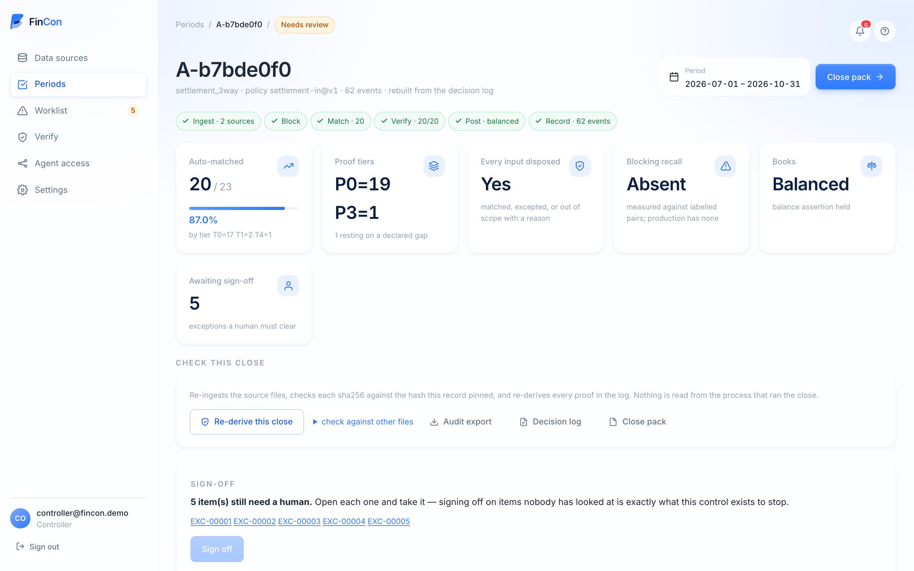
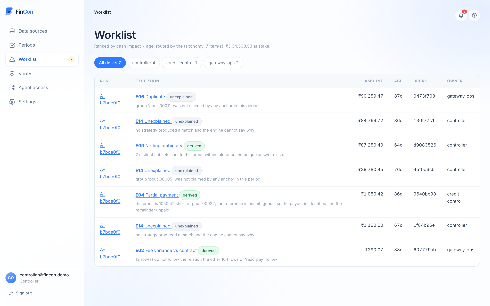
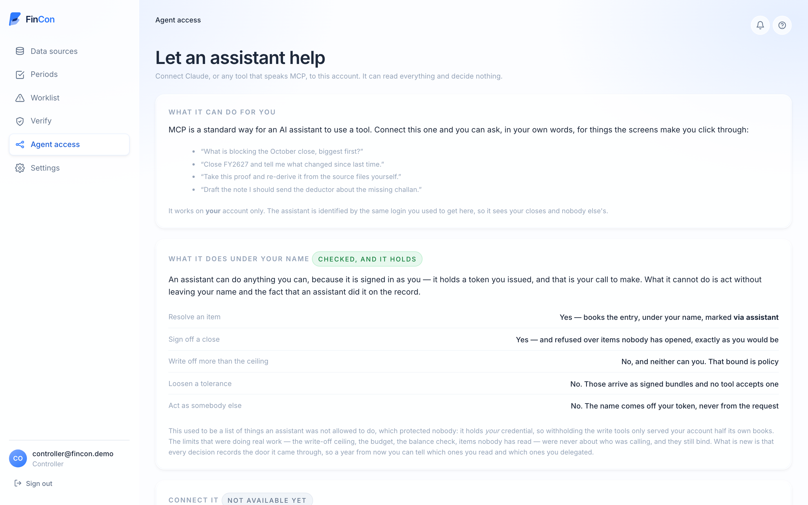

<div align="center">

<picture>
  <source media="(prefers-color-scheme: dark)" srcset="docs/media/logo-dark.svg">
  
</picture>

### Close the books with a proof, not a plug. - fincon.astutecomputer.com

FinCon reconciles what your payment gateway says it paid out against what the
bank actually received, writes the double entry, and hands back what is left —
ranked, priced and routed to a desk. Every match carries arithmetic an auditor
re-derives without us.

<br>

<a href="https://fincon.astutecomputer.com">
  
</a>
&nbsp;
<a href="mailto:abishaioff@gmail.com?subject=FinCon">
  
</a>

<br><br>


</div>

---

## The problem

**Reconciliation software already matches 90–99% of transactions.** Trintech
publishes 99%+. NetSuite ships N:M rules with a confidence-scoring assistant.
That problem is solved, and anything pitching *"our AI matches better"* is
competing on the one dimension nobody needs help with.

Two costs survive automation, and neither is a matching problem.

**The tail comes back with no reason attached.** Bank-feed automation cuts a
reconciliation from roughly 47 minutes to *exception handling only* — which is
the whole story in one statistic: the matched records were never the cost. But
the 1–10% that fails returns as a flat queue, and the controller re-derives the
context by hand, row by row. Volume fell. Cost per item did not.

**And the rate decays.** Auto-match rates are maintained, not achieved. A new
vendor format silently degrades matching until somebody writes a rule, and rule
authoring is gated behind engineering — so the person who understands the
exception is never the person who can fix it.

What a controller does today: pull three exports, match at payout level because
row level is impossible, **book the difference as a plug**, spend three days in
Excel when it does not tie, hand-type the journal, and watch the identical tail
come back next month.

---

## The solution

**Open intake, verified commit.** The model proposes. A deterministic engine
proves. A named human decides.

<div align="center">
  
</div>

### The AI does three jobs, and they are the three that need it

This is not a rules engine with a chatbot bolted on, and it is not a model
guessing at arithmetic. The model is pointed at exactly the work no
deterministic system can do:

| | |
|---|---|
| **Reads a format nobody configured** | A settlement file in a layout we have never seen. The model reads twelve raw lines and authors the parse spec — delimiter, header row, minor units, a non-ISO date. It ingests with no integration project. |
| **Names the tail** | What the arithmetic could not resolve goes to the model with the near misses the engine derived, and comes back with a code, a hypothesis and cited evidence in about **2.1s**. |
| **Writes tomorrow's rule** | You resolve a break in your own words; the model induces a deterministic rule that would have prevented it. `R-DUP-06` was written this way, from a controller's sentence, and fires on every close since. |

**The system gets more deterministic over time, not more agentic.** That is the
opposite of how agent products usually age, and it is the entire thesis.

### And it is fenced, which is why you can switch it on

Language models collapse from **95.6% on lookups to near zero on multivariate
calculation**, and they fail *confidently*. So the model is kept off the
arithmetic by construction — every boundary below is a test that fails if
someone removes it:

- **No model call in a close.** Six stages, zero model calls, and the receipt
  says so.
- **A proposal cannot overwrite a derived answer.** `P2` at best, and it may not
  overwrite `P0 ARITHMETIC` — an item the engine derived is never even offered.
- **No generated code is executed.** No `eval`, no `exec`. Adapters are
  declarative specs read by a closed vocabulary of parse verbs.
- **No tool carries authority.** Not one MCP tool accepts a policy, a tolerance,
  a sign convention or a rule set — checked against the *generated* schemas.

### Proof on every row, and four honest endings

Every accepted match emits an arithmetic object, not a confidence score: both
sides' record ids, the residual closing to zero, the tolerance consumed, the
rule that fired. **A match without a passing proof is not a match** and does not
appear in the match count.

```
match M-0412   tier T2 subset-sum   rule R-017@v3
  payout    BANK/2026-08-14/CR         +4,378.21
  charges   87 × settlement rows       +4,612.90
  refunds    4 × settlement rows         -118.40
  fees     162 × settlement rows         -114.02
  ────────────────────────────────────────────
  residual                                  0.00    tolerance used 0.00 / 0.50
  verdict   PROVEN      provenance  P0 ARITHMETIC
```

Everything left over is ranked by cash impact × age and routed to a desk. Each
item ends in double entry — **book it**, **carry it forward**, **chase it**, or
**write it off** — under your name, bounded twice by signed policy.

<div align="center">
  
</div>

---

## Impact

Measured against labels authored **before the engine existed**, and re-derived
from the decision log alone:

| | |
|---|---|
| **Auto-match** | **90.9%** — 20 of 22 anchors, by tier `T0=17 T1=2 T4=1` |
| **False matches** | **0.00%** |
| **Exception coverage** | **6 / 6** — every planted defect found |
| **Classification** | **4 / 6** correct |
| **Ambiguity** | **1 / 1** detected and *refused* rather than guessed |
| **Journal** | **23 entries, balanced** — and the beancount export is re-loaded by beancount itself |
| **Close time** | about **1.4s**, with **zero** model calls |

**The generality is measured, not asserted.** A second reconciliation — Form
26AS from the Income Tax Department against a TDS receivable ledger, matched on
`TAN + section + quarter` over an April–March year — runs on the same engine
with **zero changes to it**, asserted byte-for-byte by its gate.

**Where it says it does not know.** Three of seven items in a real close are
`E14` — *the engine cannot say why* — and that is printed at the top of the tail
rather than smoothed into a plausible guess routed to the wrong desk. `E09` is
the one to pause on: two distinct subsets sum to the same credit within
tolerance, so **there is no correct answer to pick**, and every tool that returns
the first subset it finds is confidently wrong there.

---

## Point an assistant at it — MCP

FinCon is a **Model Context Protocol** server. Ask *"what is blocking the
October close, biggest first?"* and it reads the record, runs a deterministic
close, verifies a proof, resolves an item and signs off — **as you**, because it
holds a token you issued.

```jsonc
// Claude Desktop, Claude Code, or any MCP client
{
  "mcpServers": {
    "fincon": { "url": "https://fincon.astutecomputer.com/mcp" }
  }
}
```

OAuth via Cognito, discovery at the origin per RFC 9728, dynamic client
registration. Or run it on stdio against your own files: `make mcp`.

**21 tools; 4 of them write.** An assistant is not a stranger — it carries your
credential, and the `sub` on that token is the same string your browser session
resolves to. So it can do what you can do, and **every decision records the door
it came through**, so a year from now you can tell which items you read and
which you delegated. The bounds that matter — the write-off ceiling, the budget,
the balance check, items nobody has opened — were never questions about who was
calling, and they bind an agent identically.

<div align="center">
  
</div>

---

## Architecture

**The model proposes → the engine proves → a human decides.** Nothing crosses a
boundary without a proof or a name.

```
  SOURCES                    ENGINE  (no model, ever)                 RECORD
  ─────────                  ────────────────────────                 ──────
  bank CAMT.053 ┐            ┌──────────────────────┐
  settlement    ├─ intake ──▶│ block → match         │──▶ verify ──┐
  order register┘   │        │ T0 exact              │   re-derive │
  Form 26AS     ┘   │        │ T1 tolerant           │   from raw  │
                    │        │ T2 subset-sum         │   records   │
              5 proofs       │ T4 declared           │             ▼
              row count      └──────────┬───────────┘      ┌──────────────┐
              control total             │                  │ double entry │
              roll-forward         unmatched               │ + balance    │
              type/domain              │                   │   assertion  │
              idempotence              ▼                   └──────┬───────┘
                              ┌────────────────┐                  │
                              │ near-miss      │                  ▼
                              │ diagnosis      │           hash-chained
                              │ (arithmetic)   │           decision log
                              └───────┬────────┘                  │
                                      │ genuinely unexplained     │
                                      ▼                           │
                        ╔═════════════════════════╗               │
                        ║  MODEL  (proposes only) ║               │
                        ║  adapter synthesis      ║               │
                        ║  classification         ║               │
                        ║  rule induction         ║               │
                        ╚═══════════╤═════════════╝               │
                                    │ P2 at best, never overwrites P0
                                    ▼                             │
                        ┌───────────────────────┐                 │
                        │  HUMAN decides        │◀────────────────┘
                        │  book · carry · chase │
                        │  · write off · sign   │
                        └───────────┬───────────┘
                                    ▼
                          close pack · journal.csv
                          journal.beancount · POST /v1/verify
```

**Proof tiers**, because a real close contains items nobody can derive from
arithmetic alone. The rule is *never move silently*, not *refuse what you can't
prove*:

`P0 ARITHMETIC` re-derivable by anyone · `P1 RULE` a promoted, regression-tested
rule fired · `P2 ATTESTED` a named human approved it · `P3 DECLARED` accepted
with a stated gap.

### Hosted on AWS

Live at **<https://fincon.astutecomputer.com>** — one CloudFormation stack in
`ap-south-1`. Full breakdown, including the four decisions worth arguing about
and what this estate deliberately lacks, in **[docs/14-AWS.md](docs/14-AWS.md)**.

```
   Cloudflare DNS ──▶ ALB (ACM, TLS 1.3) ──▶ ECS Fargate ──┬─▶ EFS  runs + uploads
                       :80 → :443           1 task          ├─▶ Cognito   identity
                       /healthz 30s         256cpu/512mb    ├─▶ Secrets Manager
                                            screens · API   └─▶ CloudWatch Logs
                                            · MCP /mcp
```

**EFS rather than S3** because the decision log is append-only and hash-chained
and the writer takes a POSIX lock — and `flock` silently does not work on EFS,
which nearly ended the choice. **Public subnets, no NAT** — a $32/month gateway
for a single-task estate, traded for a security group that admits only the ALB.
**Images tagged by commit sha**, never `latest`, so a rollback is nameable.

---

## Run it

```bash
make setup     # uv sync
make gen       # regenerate the synthetic batches from a seed
make verify    # every green gate
make serve     # → http://127.0.0.1:8000/
make eval      # 4 ablation arms, 9 metrics, batches A and B
make mcp       # MCP on stdio
```

`make test` and `make verify` need **no API key** — the model-backed gates are
excluded and named in the output, because a silently skipped gate that reads as
green is the failure this whole repository is about.

---

## Verify it without us

The claim is not *"trust our numbers"*. Hand an auditor the decision log and the
source files, and they re-derive every match on a public endpoint that needs no
account and touches none of our state:

```bash
curl -X POST https://fincon.astutecomputer.com/v1/verify \
     -H 'content-type: application/json' -d @docs/sample-proof.json
```

[`docs/sample-proof.json`](docs/sample-proof.json) is a real one, lifted out of
batch A's decision log — a proof and the 23 records it cites. It answers
`"proven": true`. Change one `amount` in it and it comes back **refuted**, with
the recomputed residual and the leg whose subtotal stopped adding up:

```jsonc
{"proven": false, "recomputed_residual": "-50.00", "reasons": [
  "leg 'settlement': claimed subtotal 51990.42 but its 22 record(s) sum to 52040.42 (delta 50.00)",
  "claimed residual 0.00 but the records give -50.00 (delta -50.00)"]}
```

Your own proofs come out of `GET /v1/runs/{id}/export`, which returns every
decision in a close beside the records it rests on.

Every verdict names the policy it was produced under and stamps whether that
policy was **in force** or **caller-supplied** — because a verdict produced under
a policy somebody brought with them must never come back indistinguishable from
one produced under ours.


---

## Documentation

| | |
|---|---|
| [CLAUDE.md](CLAUDE.md) | Standing context — the rules, the vocabulary, the eight invariants |
| [STATUS.md](STATUS.md) | Live build state, with the command output that proves each gate |
| [docs/01-DECISION-SPEC.md](docs/01-DECISION-SPEC.md) | Problem, solution, trade-offs |
| [docs/08-AS-BUILT.md](docs/08-AS-BUILT.md) | What actually runs today |
| [docs/10-THE-USER-FLOW.md](docs/10-THE-USER-FLOW.md) | The flow, and what it is worth |
| [docs/13-THE-SCREENS.md](docs/13-THE-SCREENS.md) | Every screen, and the question it answers |
| [docs/14-AWS.md](docs/14-AWS.md) | The AWS estate, in full |
| [docs/15-DEMO.md](docs/15-DEMO.md) | The demo film — how it is shot, cut and re-shot |
| [docs/16-SCRIPT.md](docs/16-SCRIPT.md) | The voiceover, timed against the cut |
| [docs/decisions/](docs/decisions/) | ADRs — two of them irreversible |

<div align="center">
<br>

**[Try FinCon →](https://fincon.astutecomputer.com)** &nbsp;·&nbsp;
**[Contact](mailto:abishaioff@gmail.com?subject=FinCon)**

</div>
